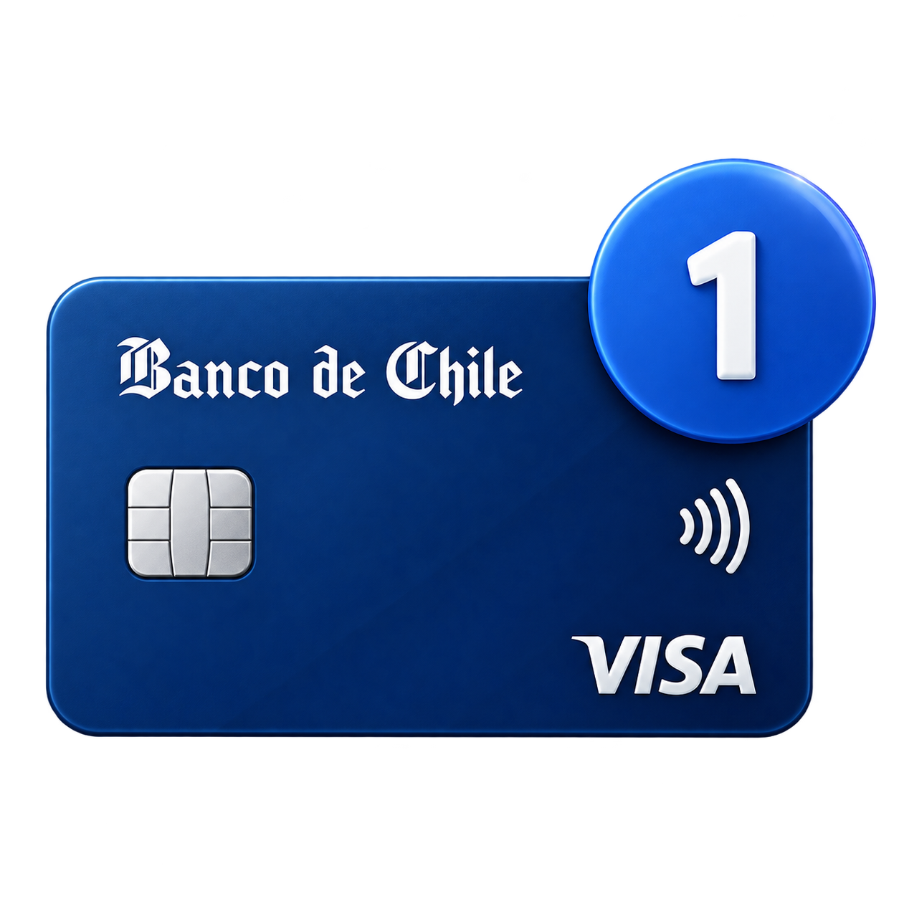
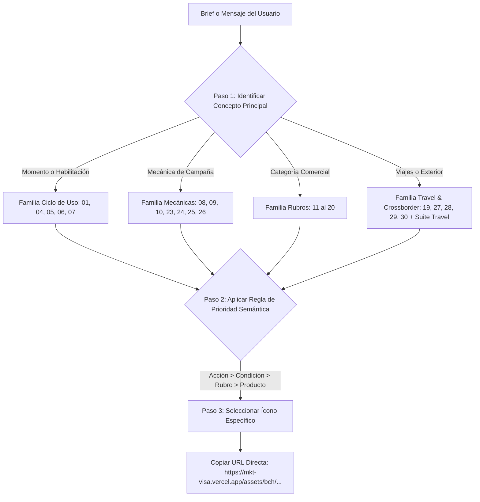

# 🧠 Banco de Chile · Matriz de Decisión Contextual & Banco Exhaustivo de Activos para IA
> **Autor:** Israel Torres  
> **Proyecto:** MKT_VISA  
> **Ámbito:** Banco de Chile · Medios de Pago · Visa · Travel Club  
> **Disponibilidad:** **100% Verificado (42 Activos Digitales Oficiales)** con URLs absolutas de producción en Vercel (`https://mkt-visa.vercel.app/assets/bch/...`), tags semánticos, disparadores en prompts y reglas de inferencia contextual para LLMs (Claude, ChatGPT, Gemini, DeepSeek, Cursor, Copilot).

---

## ⚡ DIRECTIVA CRÍTICA PARA LLMs: COMPILACIÓN WEB Y DOM-TO-PPTX (CERO CAÍDAS)

> [!IMPORTANT]
> **¿Por qué usar siempre las URLs públicas de producción en Vercel (`https://mkt-visa.vercel.app/assets/bch/...`)?**  
> 1. **Compilación Nativa DOM-to-PPTX**: Al compilar diapositivas HTML o emails a presentaciones PowerPoint nativas (`.pptx`) o plantillas de marketing, el motor realiza peticiones HTTP directas para descargar cada imagen e incrustarla como objeto binario independiente. Si usas rutas relativas (`assets/...`, `./icons/...`) o rutas locales (`file:///...`), la descarga fallará y la imagen se caerá de la pieza.
> 2. **Disponibilidad Global HTTP/2 200 OK**: El dominio `https://mkt-visa.vercel.app` cuenta con CDN global en el Edge, enrutamiento optimizado y entrega instantánea.
> 3. **Cabeceras CORS Permisivas (`*`)**: Evita bloqueos de seguridad por cross-origin en navegadores, clientes de correo y compiladores headless.
> 4. **Canal Alfa RGBA Preservado**: Los PNGs 3D cuentan con transparencia limpia de 32 bits, adaptándose sobre fondos blancos, oscuros `#002464` o degradados institucionales.

### Regla Práctica para el LLM al Generar HTML o Emails:
```html
<!-- ✅ CORRECTO: Uso de URL directa de producción en Vercel -->


<!-- ❌ INCORRECTO: Provoca enlaces rotos y caídas en compiladores -->
 <!-- Fallará por ruta relativa -->
 <!-- Fallará sin host -->
```

---

## 🎯 1. Algoritmo de Inferencia Contextual en 3 Pasos (Para el LLM)

Cuando recibas un requerimiento de campaña, diseño de email, ficha técnica, diapositiva o banner para Banco de Chile:



### Regla de Prioridad Semántica:
Si el texto de la comunicación combina varios conceptos, prioriza en este orden exacto:
1. **Acción requerida del cliente** (*activa*, *compra por primera vez*, *reactiva*, *inscribe*).
2. **Mecánica o condición comercial** (*cashback*, *descuento %*, *cuotas sin interés*, *meta de compras*).
3. **Rubro o comercio específico** (*supermercado*, *restaurante*, *combustible*, *farmacia*).
4. **Producto o canal** (*tarjeta de crédito*, *wallet*, *POS físico*, *ecommerce*).
5. **Contexto experiencial** (*viaje*, *aeropuerto*).

*Ejemplo:*  
> *"Obtén 30% de descuento en tu primera compra en restaurantes pagando con tu Tarjeta Banco de Chile."*  
- Si el bloque destaca el incentivo inicial: `06_primera_compra.png`  
- Si el bloque destaca el ahorro: `24_descuento.png`  
- Si el bloque ilustra la categoría gastronómica: `12_gastronomia_restaurantes.png`  
- Si el bloque explica el plástico: `01_tarjeta.png`  

---

## 🌳 2. Árbol de Decisión Rápido

```text
¿El mensaje trata sobre el medio de pago o canal?
│
├── Tarjeta genérica (sin canal específico)           ──► 01_tarjeta.png
├── Compra presencial en tienda / POS                 ──► 02_pago_presencial_pos.png
├── Compra online nacional / sitio web                ──► 03_ecommerce.png
├── Billetera digital (Apple Pay, Google Pay, Celular)──► 04_wallet_pago_movil.png
├── Pago sin contacto / Contactless / Tap to pay      ──► 21_contactless.png
├── Guardar tarjeta en apps (Card on File)            ──► 22_card_on_file_cof.png
└── Suscripción o cargo mensual recurrente (PAT)      ──► 23_pago_recurrente.png

¿El mensaje trata sobre etapa del cliente o ciclo de vida?
│
├── Desbloqueo / Bienvenida / Habilitar plástico      ──► 05_activacion.png
├── Debut del cliente / Primera transacción           ──► 06_primera_compra.png
└── Cliente inactivo / Dormido / Vuelve a usar        ──► 07_reactivacion.png

¿El mensaje trata sobre incentivo, beneficio o financiamiento?
│
├── Reintegro posterior en dinero a la cuenta         ──► 09_cashback.png
├── Acumulación o canje de Dólares-Premio             ──► 10_dolares_premio.png
├── Descuento porcentual directo (30% OFF)            ──► 24_descuento.png
└── Cuotas sin interés (3, 6, 12 cuotas precio contado)──► 25_cuotas_sin_interes_csi.png

¿El mensaje trata sobre una meta o desafío?
│
├── Meta por cantidad de compras (ej. haz 5 compras)  ──► 08_meta_de_transacciones.png
└── Meta por monto de gasto (ej. factura $300.000)    ──► 26_meta_de_facturacion.png

¿El mensaje trata sobre un rubro de consumo?
│
├── Supermercados y alimentación                      ──► 11_supermercado.png
├── Restaurantes, cenas y salidas                     ──► 12_gastronomia_restaurantes.png
├── Cafeterías y pausas de café                       ──► 13_cafe_cafeterias.png
├── Combustible, bencina y estaciones de servicio     ──► 14_combustible.png
├── Farmacias, salud y bienestar                      ──► 15_farmacia_salud.png
├── Tiendas de retail, vestuario y shopping mall      ──► 16_retail_shopping.png
├── Tecnología, computación, telefonía y electro      ──► 17_tecnologia.png
├── Apps de despacho y comida a domicilio (Delivery)  ──► 18_delivery.png
├── Viajes, turismo y vacaciones (genérico)           ──► 19_viajes_turismo.png
└── Conciertos, cines, espectáculos y entretenimiento ──► 20_entretenimiento_musica.png

¿El mensaje trata sobre compras internacionales o beneficios de viaje?
│
├── Compra presencial en el extranjero (crossborder)  ──► 27_compra_internacional_crossborder.png
├── Compra online en tiendas extranjeras (Amazon, etc)──► 28_ecommerce_internacional.png
├── Salones VIP / Lounge en aeropuertos               ──► 29_lounge_salon_vip.png
└── Traslado privado / Transfer al aeropuerto         ──► 30_traslado_aeropuerto.png
```

---

## 📦 3. Catálogo Maestro: Los 30 Íconos 3D Banco de Chile (HQ)

Todos los íconos están renderizados en alta resolución tridimensional con iluminación corporativa, disponibles inmediatamente en el CDN de producción.

| ID | Nombre Archivo | Concepto Semántico | Triggers en el Prompt | Cuándo Usar | Cuándo NO Usar | URL CDN Vercel (Producción) | Tag HTML Listo |
|:---|:---|:---|:---|:---|:---|:---|:---|
| **01** | `01_tarjeta.png` | Tarjeta como medio de pago | *tarjeta, crédito, débito, plástico, medios de pago, tus tarjetas del chile* | Presentación genérica del producto o portafolio. | Si existe una acción o canal específico. | `https://mkt-visa.vercel.app/assets/bch/icons/01_tarjeta.png` | `` |
| **02** | `02_pago_presencial_pos.png` | Compra presencial POS | *pos, caja, tienda física, punto de venta, presencial* | Compras en comercio físico en caja o terminal. | Ecommerce o pago móvil con wallet. | `https://mkt-visa.vercel.app/assets/bch/icons/02_pago_presencial_pos.png` | `` |
| **03** | `03_ecommerce.png` | Compra online nacional | *ecommerce, compras online, sitio web, cnp, carrito, web* | Compras en tiendas digitales chilenas. | Compras en sitios extranjeros (Amazon, etc). | `https://mkt-visa.vercel.app/assets/bch/icons/03_ecommerce.png` | `` |
| **04** | `04_wallet_pago_movil.png` | Wallet / Pago Móvil | *wallet, apple pay, google pay, billetera digital, pagar con celular, reloj* | Enrolamiento y pago con smartphones o smartwatches. | Guardar tarjeta en apps (COF) sin NFC. | `https://mkt-visa.vercel.app/assets/bch/icons/04_wallet_pago_movil.png` | `` |
| **05** | `05_activacion.png` | Activación de tarjeta | *activar, habilitar, encendido, onboarding, clave pin, tarjeta lista* | Desbloqueo inicial del plástico y bienvenida. | Clientes que ya compraban o reactivación. | `https://mkt-visa.vercel.app/assets/bch/icons/05_activacion.png` | `` |
| **06** | `06_primera_compra.png` | Primer uso / Debut | *primera compra, primer uso, transacción debut, estrena tu tarjeta* | Campañas dirigidas a que el cliente realice su primera compra. | Clientes recurrentes o inactivos. | `https://mkt-visa.vercel.app/assets/bch/icons/06_primera_compra.png` | `` |
| **07** | `07_reactivacion.png` | Reactivación / Retorno | *inactivo, reactiva, vuelve a usar, te extrañamos, retoma tus beneficios* | Mensajes M1-M3 para despertar clientes dormidos. | Altas nuevas o activación de tarjeta. | `https://mkt-visa.vercel.app/assets/bch/icons/07_reactivacion.png` | `` |
| **08** | `08_meta_de_transacciones.png` | Meta por cantidad de compras | *meta transacciones, haz 3 compras, 5 compras al mes, desafío compras* | Cuando la condición es alcanzar un número exacto de compras. | Metas de monto acumulado en pesos. | `https://mkt-visa.vercel.app/assets/bch/icons/08_meta_de_transacciones.png` | `` |
| **09** | `09_cashback.png` | Cashback / Abono dinero | *cashback, abono, devolución, reintegro, te devolvemos, abono en cuenta* | Beneficio que devuelve dinero posterior a la compra. | Descuento directo en caja o cupón. | `https://mkt-visa.vercel.app/assets/bch/icons/09_cashback.png` | `` |
| **10** | `10_dolares_premio.png` | Dólares-Premio (DP) | *dólares premio, dp, travel club, acumula dp, canje travel* | Programa de lealtad Travel Club y canje de puntos. | Cashback en dinero en pesos chilenos. | `https://mkt-visa.vercel.app/assets/bch/icons/10_dolares_premio.png` | `` |
| **11** | `11_supermercado.png` | Supermercados | *supermercado, alimentos, compras de casa, jumbo, lider, santa isabel* | Promociones en cadenas de supermercados. | Restaurantes o apps de comida delivery. | `https://mkt-visa.vercel.app/assets/bch/icons/11_supermercado.png` | `` |
| **12** | `12_gastronomia_restaurantes.png` | Gastronomía & Restaurantes | *restaurantes, gastronomía, cenas, comida, gourmet, salidas* | Promociones y descuentos en restaurantes físicos. | Cafeterías específicas o pedidos delivery. | `https://mkt-visa.vercel.app/assets/bch/icons/12_gastronomia_restaurantes.png` | `` |
| **13** | `13_cafe_cafeterias.png` | Cafés & Cafeterías | *café, starbucks, dunkin, cafetería, desayuno, pausa café* | Alianzas con cadenas de café y consumo diario. | Restaurantes formales o supermercados. | `https://mkt-visa.vercel.app/assets/bch/icons/13_cafe_cafeterias.png` | `` |
| **14** | `14_combustible.png` | Combustible & Bencina | *bencina, combustible, estaciones de servicio, shell, copec, litro* | Ahorro y descuentos por litro en bencineras. | Transporte público o traslados aeropuerto. | `https://mkt-visa.vercel.app/assets/bch/icons/14_combustible.png` | `` |
| **15** | `15_farmacia_salud.png` | Farmacias & Salud | *farmacia, salud, cruz verde, medicamentos, bienestar, cuidado* | Descuentos en cadenas de farmacias y bienestar. | Seguros de salud o asistencia médica exterior. | `https://mkt-visa.vercel.app/assets/bch/icons/15_farmacia_salud.png` | `` |
| **16** | `16_retail_shopping.png` | Retail & Shopping | *retail, shopping, tiendas, vestuario, mall, moda, calzado* | Promociones en tiendas por departamento y centros comerciales. | Ecommerce puro si el foco es el canal digital. | `https://mkt-visa.vercel.app/assets/bch/icons/16_retail_shopping.png` | `` |
| **17** | `17_tecnologia.png` | Tecnología & Electro | *tecnología, computadores, celulares, electrónica, notebooks, gadgets* | Promociones en electrónica, smartphones y tecnología. | Retail general sin foco en electrónica. | `https://mkt-visa.vercel.app/assets/bch/icons/17_tecnologia.png` | `` |
| **18** | `18_delivery.png` | Delivery & Apps de comida | *delivery, pedidosya, rappi, uber eats, a domicilio, pedidos app* | Descuentos en aplicaciones de delivery de comida. | Restaurantes presenciales. | `https://mkt-visa.vercel.app/assets/bch/icons/18_delivery.png` | `` |
| **19** | `19_viajes_turismo.png` | Viajes & Turismo genérico | *viajes, turismo, vuelos, vacaciones, pasajes, paquetes* | Promociones de turismo general y aerolíneas. | Beneficios de aeropuerto específicos (lounge/transfer). | `https://mkt-visa.vercel.app/assets/bch/icons/19_viajes_turismo.png` | `` |
| **20** | `20_entretenimiento_musica.png` | Entretenimiento & Conciertos | *conciertos, música, cine, espectáculos, preventa, entradas, eventos* | Preventas exclusivas Banco de Chile y cines. | Gastronomía o turismo. | `https://mkt-visa.vercel.app/assets/bch/icons/20_entretenimiento_musica.png` | `` |
| **21** | `21_contactless.png` | Pago Sin Contacto | *contactless, sin contacto, nfc, tap to pay, acerca tu tarjeta* | Destacar la comodidad de pagar acercando la tarjeta. | Foco exclusivo en wallet móvil de celular. | `https://mkt-visa.vercel.app/assets/bch/icons/21_contactless.png` | `` |
| **22** | `22_card_on_file_cof.png` | Card on File (COF) | *card on file, cof, inscribe tarjeta, guarda tu tarjeta, apps favoritas* | Campañas para inscribir tarjeta en Spotify, Uber, Netflix, etc. | Suscripción automática con cobro fijo (PAT). | `https://mkt-visa.vercel.app/assets/bch/icons/22_card_on_file_cof.png` | `` |
| **23** | `23_pago_recurrente.png` | Pago Recurrente / PAT | *pago recurrente, pat, pago automático, cuentas, servicios, autopistas* | Pago automático recurrente de cuentas básicas o donaciones. | Solo inscribir tarjeta en una app sin cobro mensual. | `https://mkt-visa.vercel.app/assets/bch/icons/23_pago_recurrente.png` | `` |
| **24** | `24_descuento.png` | Descuento / Porcentaje OFF | *descuento, % off, rebaja, 20% descuento, 30% off, ahorro* | Beneficio de porcentaje o rebaja monetaria inmediata. | Devolución posterior de dinero (cashback). | `https://mkt-visa.vercel.app/assets/bch/icons/24_descuento.png` | `` |
| **25** | `25_cuotas_sin_interes_csi.png` | Cuotas Sin Interés (CSI) | *cuotas sin interés, csi, 3 cuotas, 6 cuotas, 12 cuotas, precio contado* | Campañas de financiamiento sin recargo de intereses. | Descuentos en precio o cashback. | `https://mkt-visa.vercel.app/assets/bch/icons/25_cuotas_sin_interes_csi.png` | `` |
| **26** | `26_meta_de_facturacion.png` | Meta por monto de gasto | *meta facturación, gasta $100.000, acumula $200.000, spend target* | Cuando la condición es alcanzar un monto en pesos. | Metas por número de compras. | `https://mkt-visa.vercel.app/assets/bch/icons/26_meta_de_facturacion.png` | `` |
| **27** | `27_compra_internacional_crossborder.png` | Compra presencial internacional | *crossborder, compras en el extranjero, compras fuera de chile, viajes usd* | Compras con tarjeta física en tiendas fuera del país. | Compras online internacionales (Amazon). | `https://mkt-visa.vercel.app/assets/bch/icons/27_compra_internacional_crossborder.png` | `` |
| **28** | `28_ecommerce_internacional.png` | Ecommerce Internacional | *ecommerce internacional, amazon, aliexpress, shein, web internacional, cnp usd* | Compras online en comercios extranjeros en dólares/divisas. | Compras físicas en el extranjero. | `https://mkt-visa.vercel.app/assets/bch/icons/28_ecommerce_internacional.png` | `` |
| **29** | `29_lounge_salon_vip.png` | Salón VIP / Lounge | *lounge, salón vip, visa airport companion, pacific club, aeropuerto vip* | Acceso y beneficios en salones VIP de aeropuertos. | Pasajes aéreos o turismo genérico. | `https://mkt-visa.vercel.app/assets/bch/icons/29_lounge_salon_vip.png` | `` |
| **30** | `30_traslado_aeropuerto.png` | Traslado al Aeropuerto | *traslado, transfer, transvip, aeropuerto, van aeropuerto, traslado gratis* | Servicio de transporte hacia o desde el aeropuerto. | Combustible o movilidad urbana común. | `https://mkt-visa.vercel.app/assets/bch/icons/30_traslado_aeropuerto.png` | `` |

---

## ✈️ 4. Suite Travel Club Banco de Chile (10 Íconos Especializados)

Para piezas dedicadas al programa Travel Club, alianzas con aerolíneas y beneficios de temporada de viajes:

| ID | Nombre Archivo | Concepto Semántico | Triggers en el Prompt | URL CDN Vercel (Producción) | Tag HTML Listo |
|:---|:---|:---|:---|:---|:---|
| **T01** | `01_bch_icono_ticket_viaje_ncde7f.png` | Ticket de Vuelo / Boarding Pass | *boarding pass, pasaje, ticket viaje, vuelo, check-in, aerolínea* | `https://mkt-visa.vercel.app/assets/bch/travel/01_bch_icono_ticket_viaje_ncde7f.png` | `` |
| **T02** | `02_bch_icono_dolares_premio_pplf0o.png` | Moneda Dólares-Premio Travel | *moneda travel, canje dólares premio, saldo dp, acumulación viaje* | `https://mkt-visa.vercel.app/assets/bch/travel/02_bch_icono_dolares_premio_pplf0o.png` | `` |
| **T03** | `03_bch_icono_cuotas_viaje_kml5fp.png` | Cuotas sin Interés en Pasajes | *cuotas viaje, 3 a 12 cuotas pasajes, financiamiento turismo, cuotas travel* | `https://mkt-visa.vercel.app/assets/bch/travel/03_bch_icono_cuotas_viaje_kml5fp.png` | `` |
| **T04** | `04_bch_icono_tasa_preferencial_viajes_qwzxxt.png` | Tasa Preferencial de Viaje | *tasa preferencial, cambio dólar travel, beneficio cambio divisa* | `https://mkt-visa.vercel.app/assets/bch/travel/04_bch_icono_tasa_preferencial_viajes_qwzxxt.png` | `` |
| **T05** | `05_bch_icono_tarjeta_activada_extranjero_h03q2v.png` | Tarjeta Lista para el Exterior | *aviso de viaje, tarjeta en el extranjero, habilitación internacional* | `https://mkt-visa.vercel.app/assets/bch/travel/05_bch_icono_tarjeta_activada_extranjero_h03q2v.png` | `` |
| **T06** | `06_bch_icono_traslado_aeropuerto_r9goav.png` | Van de Transfer Aeropuerto | *van transfer, transfer aeropuerto, movilización privada, van travel* | `https://mkt-visa.vercel.app/assets/bch/travel/06_bch_icono_traslado_aeropuerto_r9goav.png` | `` |
| **T07** | `07_bch_icono_avion_despegue_gcez6a.png` | Avión en Despegue | *vuelo internacional, despegue, avión, escapada, vacaciones, destino* | `https://mkt-visa.vercel.app/assets/bch/travel/07_bch_icono_avion_despegue_gcez6a.png` | `` |
| **T08** | `08_bch_icono_hotel_premium_aylvme.png` | Hoteles & Alojamiento Premium | *hotel, estadía, resort, alojamiento travel, reserva hotelera* | `https://mkt-visa.vercel.app/assets/bch/travel/08_bch_icono_hotel_premium_aylvme.png` | `` |
| **T09** | `09_bch_icono_maleta_viaje_ntmoww.png` | Maleta de Viaje / Equipaje | *maleta, equipaje, vacaciones, armar maleta, verano, viaje seguro* | `https://mkt-visa.vercel.app/assets/bch/travel/09_bch_icono_maleta_viaje_ntmoww.png` | `` |
| **T10** | `10_bch_icono_bono_bienvenida_iaohbl.png` | Caja Regalo / Bono Bienvenida | *bono bienvenida, regalo travel, puntos de bienvenida, bienvenida travel* | `https://mkt-visa.vercel.app/assets/bch/travel/10_bch_icono_bono_bienvenida_iaohbl.png` | `` |

---

## 🏛️ 5. Identidad Corporativa Oficial Banco de Chile (Logos)

Para encabezados de email, firmas legales y co-branding institucional:

| Recurso | Tipo | Descripción | URL CDN Vercel (Producción) | Tag HTML Listo |
|:---|:---|:---|:---|:---|
| `banco_de_chile.png` | Logotipo Horizontal | Logotipo oficial completo Banco de Chile para cabeceras principales | `https://mkt-visa.vercel.app/assets/bch/logos/banco_de_chile.png` | `` |
| `bch_logo.png` | Isotipo / Estrella | Isotipo icónico de estrella azul para avatares, favicon o badges compactos | `https://mkt-visa.vercel.app/assets/bch/logos/bch_logo.png` | `` |

---

## ⚖️ 6. Criterios de Desempate Semántico

Cuando dos íconos parezcan encajar en un mismo mensaje, resuelve siempre según estas reglas:

### 1. Cashback vs Descuento
- **Cashback (`09_cashback.png`)**: Cuando el beneficio es una **devolución de dinero posterior**, abono en el estado de cuenta o reintegro (*"te devolvemos $20.000"*).
- **Descuento (`24_descuento.png`)**: Cuando la rebaja se aplica **inmediatamente en el precio de compra** (*"30% OFF en caja o código promo"*).

### 2. Activación vs Primera Compra vs Reactivación
- **Activación (`05_activacion.png`)**: Producto nuevo recibido; el foco es encenderlo, definir clave PIN o habilitarlo en la app.
- **Primera Compra (`06_primera_compra.png`)**: Plástico ya activo pero nunca usado; premia romper la inercia del debut transaccional.
- **Reactivación (`07_reactivacion.png`)**: Cliente antiguo que dejó de facturar en los últimos 30-90 días; campaña de retención o recuperación (*"vuelve a usar tu tarjeta"*).

### 3. Ecommerce Nacional vs Ecommerce Internacional
- **Ecommerce Nacional (`03_ecommerce.png`)**: Sitios web chilenos, Mercado Libre Chile, Falabella.com, pagos con Webpay.
- **Ecommerce Internacional (`28_ecommerce_internacional.png`)**: Tiendas transfronterizas facturadas en el exterior (Amazon, AliExpress, Shein, eBay, Asos).

### 4. Compra Internacional Presencial vs Viaje / Turismo
- **Compra Internacional (`27_compra_internacional_crossborder.png`)**: Foco en la **transacción física en comercios del extranjero** durante vacaciones o viajes de trabajo.
- **Viajes & Turismo (`19_viajes_turismo.png`)**: Foco en el **destino, compra de pasajes o paquetes turísticos**.

### 5. Card on File (COF) vs Pago Recurrente (PAT)
- **Card on File (`22_card_on_file_cof.png`)**: Enrolar y guardar la tarjeta como método preferido en apps de uso esporádico (Uber, Cabify, PedidosYa).
- **Pago Recurrente (`23_pago_recurrente.png`)**: Cobro automático mensual periódico y desatendido (cuentas de luz, agua, autopistas, seguros).

### 6. Meta de Transacciones vs Meta de Facturación
- **Meta de Transacciones (`08_meta_de_transacciones.png`)**: Desafío por **frecuencia o cantidad de compras** (*"haz 5 compras de cualquier monto"*).
- **Meta de Facturación (`26_meta_de_facturacion.png`)**: Desafío por **monto acumulado de gasto** (*"acumula $300.000 en compras durante el mes"*).

---

## 🎨 7. Arquetipos de Campaña y Combinaciones Recomendadas

Cuando armes plantillas modulares o correos de 2 a 3 columnas, utiliza estas combinaciones probadas:

### Arquetipo A: Onboarding Temprano (M0 a M3)
- **Columna 1**: `05_activacion.png` (Activa tu tarjeta en Mi Banco)
- **Columna 2**: `04_wallet_pago_movil.png` (Agrégala a Apple Pay / Google Pay)
- **Columna 3**: `06_primera_compra.png` (Gana $10.000 en tu primera compra)

### Arquetipo B: Reactivación de Inactivos
- **Hero / Bloque Principal**: `07_reactivacion.png` (¡Te extrañamos! Vuelve a disfrutar tus beneficios)
- **Incentivo**: `09_cashback.png` (Recibe $15.000 de abono en tu estado de cuenta)
- **Rubro Sugerido**: `11_supermercado.png` o `14_combustible.png` (En compras cotidianas)

### Arquetipo C: Temporada de Vacaciones & Crossborder
- **Columna 1 (Online Exterior)**: `28_ecommerce_internacional.png` (Compras sin comisión internacional)
- **Columna 2 (Presencial)**: `27_compra_internacional_crossborder.png` (Paga seguro en cualquier POS del mundo)
- **Columna 3 (Lounge)**: `29_lounge_salon_vip.png` (Acceso exclusivo a Salones Pacific Club)

### Arquetipo D: Campaña Cyber / Cuotas sin Interés
- **Columna 1**: `25_cuotas_sin_interes_csi.png` (Hasta 12 cuotas sin interés)
- **Columna 2**: `17_tecnologia.png` (Notebooks, smartphones y gaming)
- **Columna 3**: `03_ecommerce.png` (Despacho gratis en comercios adheridos)

---

## 🤖 8. Prompt de Sistema Recomendado para Agentes LLM

Inyecta este prompt en cualquier agente o asistente para garantizar selección determinista:

```text
Eres el Selector Especializado de Iconografía para Medios de Pago de Banco de Chile y Visa.

Tu objetivo es analizar el requerimiento del usuario, identificar el concepto semántico dominante y devolver el ícono oficial más preciso de la librería BCH (42 activos disponibles).

Directivas de Operación:
1. SIEMPRE utiliza las URLs absolutas de producción en Vercel con prefijo: https://mkt-visa.vercel.app/assets/bch/...
2. Aplica la Prioridad Semántica: Acción > Condición/Mecánica > Rubro > Producto > Contexto.
3. Distingue estrictamente:
   - Cashback (09) vs Descuento (24)
   - Activación (05) vs Primera Compra (06) vs Reactivación (07)
   - Meta Transacciones (08) vs Meta Facturación (26)
   - Ecommerce Nacional (03) vs Ecommerce Internacional (28)
   - Card on File (22) vs Pago Recurrente (23)
4. Si la campaña es del programa Travel Club, puedes seleccionar de la suite especializada Travel (T01 a T10).
5. Devuelve la respuesta en formato JSON estrictamente válido.
```

### Formato de Salida JSON:
```json
{
  "icon_id": "06",
  "icon_name": "Primera Compra",
  "filename": "06_primera_compra.png",
  "cdn_url": "https://mkt-visa.vercel.app/assets/bch/icons/06_primera_compra.png",
  "html_tag": "",
  "reason": "La campaña premia la realización del debut transaccional del cliente con un beneficio de bienvenida.",
  "secondary_icon": {
    "filename": "09_cashback.png",
    "cdn_url": "https://mkt-visa.vercel.app/assets/bch/icons/09_cashback.png"
  },
  "confidence": 0.99
}
```

---

## 🧪 9. Casos de Prueba Verificados

#### Caso 1: Campaña de Ahorro en Gasolina
- **Input:** *"Carga combustible los lunes en Shell y obtén $50 de descuento por litro pagando con tus tarjetas del Chile."*
- **Selección Principal:** `14_combustible.png` (`https://mkt-visa.vercel.app/assets/bch/icons/14_combustible.png`)
- **Secundario Opcional:** `24_descuento.png`
- **Motivo:** El rubro comercial (combustible) es el beneficio nuclear del mensaje.

#### Caso 2: Campaña de Viajes al Extranjero
- **Input:** *"Viaja tranquilo: disfruta de traslados al aeropuerto y salones VIP con tu Tarjeta Visa Infinite."*
- **Selección Principal:** `29_lounge_salon_vip.png` (`https://mkt-visa.vercel.app/assets/bch/icons/29_lounge_salon_vip.png`)
- **Secundario:** `30_traslado_aeropuerto.png` (`https://mkt-visa.vercel.app/assets/bch/icons/30_traslado_aeropuerto.png`)
- **Motivo:** Destaca beneficios específicos de aeropuerto de alta gama.

#### Caso 3: Desafío de Uso Mensual
- **Input:** *"Realiza 5 compras sobre $10.000 con tu tarjeta este mes y participa por $500.000."*
- **Selección Principal:** `08_meta_de_transacciones.png` (`https://mkt-visa.vercel.app/assets/bch/icons/08_meta_de_transacciones.png`)
- **Motivo:** La mecánica condicionante es el cumplimiento del conteo de 5 compras.
